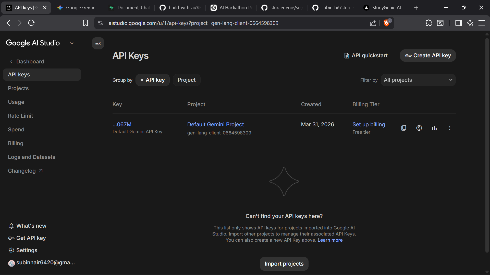
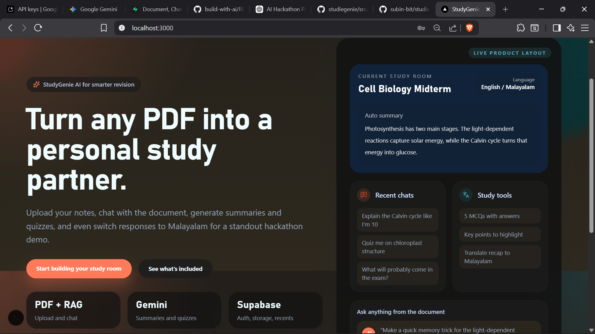
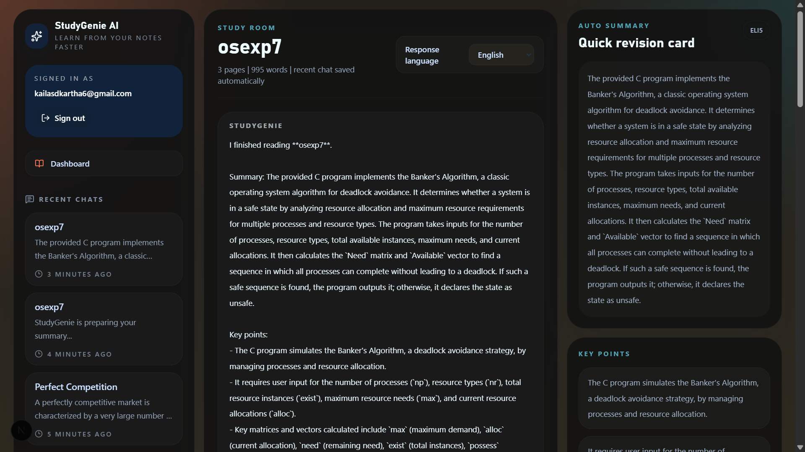

# StudyGenie AI

## Problem Statement
Students often struggle with understanding large volumes of study material such as PDFs, notes, and research articles. Traditional learning methods are time-consuming, lack personalization, and make it difficult to quickly extract key insights or clarify doubts.

There is a need for an intelligent system that can:

 - Simplify complex content
 - Provide instant explanations
 - Enable interactive learning

## Project Description
StudyGenie AI is an AI-powered research assistant that transforms static study materials into an interactive learning experience.

Users can upload documents and:

Instantly generate summaries
Ask questions and get contextual answers
Receive simplified explanations (ELI5 mode)
Generate quizzes for self-assessment

The system uses advanced AI models combined with document retrieval techniques to understand and respond accurately based on uploaded content.

⚙️ How It Works
User uploads a PDF or document
Text is extracted and processed
AI creates embeddings for semantic understanding
Relevant content is retrieved using vector search
AI generates accurate, context-aware responses

---

## Google AI Usage
### Tools / Models Used
- Google Gemini API
- Google AI Studio

### How Google AI Was Used
Google Gemini is used as the core intelligence of the system:

📄 Document Understanding: Gemini processes extracted text and understands context
💬 Conversational AI: Handles user queries and generates accurate answers
🧠 Summarization: Converts long content into concise summaries
🧒 Simplification (ELI5): Explains complex topics in simple language
❓ Quiz Generation: Creates questions based on document content

The system integrates Gemini with a retrieval-based approach (RAG) to ensure responses are grounded in the uploaded documents.

---

## Proof of Google AI Usage



---

## Screenshots

  


---

## Demo Video
[Watch Demo](./assets/demo(1).mp4)

---

## Installation Steps

```bash
# Clone the repository
git clone https://github.com/subin-bit/studiegenie.git

# Go to project folder
cd studiegenie

# Install dependencies
npm install

# Run the project
npm run dev
